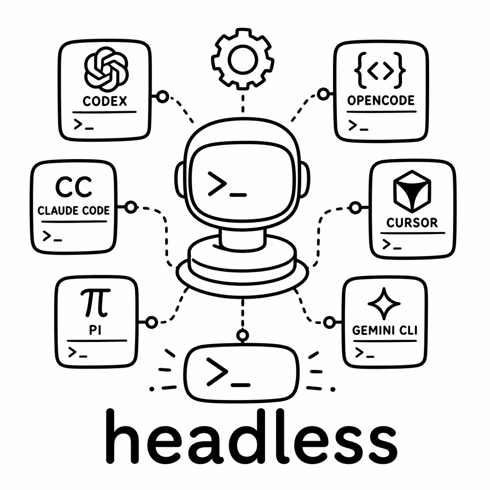

<p align="center">
  
</p>

<h1 align="center">Headless CLI</h1>

<p align="center">
  One CLI entrypoint for running Claude, Codex, Cursor, Gemini, Pi, and OpenCode in headless mode.
</p>

<p align="center">
  
  
  
</p>

Headless normalizes the small but annoying differences between coding-agent CLIs. It gives each agent the same prompt, model, workdir, dry-run, and config-inspection interface while preserving the native command flags needed for non-interactive execution.
Pass `--tmux` when you want the same prompt launched in an interactive agent session instead.

## Quick Start

### With npx

```bash
npx -y @roberttlange/headless codex --prompt "Hello world"
```

### Global install

```bash
npm install -g @roberttlange/headless
headless codex --prompt "Hello world"
```

## 60-Second Usage

```bash
# Use default configured provider with an inline prompt.
headless --prompt "Inspect this repository"
# Run Codex with an explicit model override.
headless codex --prompt "Run the tests and fix failures" --model gpt-5.2
# Load prompt from file and target another repo path.
headless claude --prompt-file prompt.md --work-dir /path/to/project
# Print resolved OpenCode adapter configuration and exit.
headless opencode --show-config
# Show the backend command without executing it.
headless gemini --prompt "Summarize the codebase" --print-command
# Stream structured JSON output for scripting.
headless pi --prompt "Summarize this repo" --json
# Stream JSON output and append the extracted final message.
headless codex --prompt "Fix the failing tests" --debug
# Launch in tmux for persistent interactive sessions.
headless codex --prompt "Fix the failing tests" --tmux
# Restrict tool permissions to read-only actions.
headless codex --allow read-only --prompt "Review this repo"
# Allow all tools for autonomous execution.
headless gemini --allow yolo --prompt "Fix the failing tests"
# Validate local setup and environment.
headless --check
# List discovered providers and adapters.
headless --list
```

Pipe a prompt over stdin:

```bash
printf "Review this diff" | headless pi --model claude-opus
```

## Supported Agents

| Agent | Command shape |
| --- | --- |
| `claude` | `claude -p ... --output-format stream-json --verbose --dangerously-skip-permissions` |
| `codex` | `codex exec --json --dangerously-bypass-approvals-and-sandbox --skip-git-repo-check ...` |
| `cursor` | `agent -p --force --output-format stream-json ...` |
| `gemini` | `gemini -p ... --output-format stream-json --yolo` |
| `opencode` | `opencode run --format json ...` |
| `pi` | `pi --no-session --mode json ...` |

Pass `--allow read-only` to use each agent's read-only/planning mode where available. Pass `--allow yolo` to explicitly request each agent's native auto-approve/bypass mode. When `--allow` is omitted, Headless preserves its existing default command shapes.

By default, Headless prints the agent's final assistant message. Pass `--json` to stream the raw native JSON trace, or `--debug` to stream the trace and append the extracted final message.
When no agent is specified, Headless selects the first installed agent in this order: `codex`, `claude`, `pi`, `opencode`, `gemini`, `cursor`.

## 4 Execution Modes

### 1) Raw mode (default)

Raw mode runs headless in the current terminal and prints the extracted final assistant message.

```bash
headless codex --prompt "Fix the failing tests"
```

### 2) JSON mode (`--json`)

JSON mode runs headless in the current terminal and streams the agent's native JSON trace for scripting or post-processing.

```bash
headless pi --prompt "Summarize this repo" --json
```

`--json` only applies to headless execution and cannot be combined with `--tmux`.

### 3) Debug mode (`--debug`)

Debug mode runs headless in the current terminal, streams the agent's native JSON trace, then appends the extracted final assistant message.

```bash
headless codex --prompt "Fix the failing tests" --debug
```

`--debug` only applies to headless execution and cannot be combined with `--json` or `--tmux`.

### 4) tmux mode (`--tmux`)

tmux mode creates a detached session named `headless-<agent>-<pid>`, starts the selected agent in interactive mode with the prompt as its initial message, prints an attach command, and exits.

```bash
headless claude --prompt-file task.md --work-dir /path/to/project --tmux
tmux attach-session -t headless-claude-12345
```

Use `--print-command --tmux` to preview the tmux launch command without starting a session.
Claude tmux launches include `--dangerously-skip-permissions` and pre-trust the launch directory so detached sessions do not block on trust or permission prompts.
Cursor tmux launches pre-trust the launch directory so detached sessions do not block on workspace trust.
Gemini tmux launches include `--skip-trust` so detached sessions do not block on folder trust prompts.
OpenCode tmux launches start the TUI, wake it, paste the prompt through a tmux buffer, then send `Enter` so the prompt is submitted after the TUI is ready.
Use `headless --list` to list active tmux sessions created by Headless, or `headless codex --list` to list sessions for one agent.
Use `headless send <session-name> --prompt "..."` to send a follow-up message to an existing Headless tmux session.

```bash
headless --list
headless send headless-codex-12345 --prompt "Run the focused tests now"
```

## CLI Reference

```bash
headless [agent] (--prompt <text> | --prompt-file <path> | --check | --list | --show-config) [options]
headless send <session-name> (--prompt <text> | --prompt-file <path>) [options]
```

Options:

- `--prompt`, `-p`: prompt text.
- `--prompt-file`: read prompt from a file.
- `--model`, `--agent-model`: model override passed to the agent CLI.
- `--allow`: permission mode, either `read-only` or `yolo`.
- `--work-dir`, `-C`: run the agent from a specific working directory.
- `--json`: stream the raw agent JSON trace instead of extracting the final message.
- `--debug`: stream the raw agent JSON trace and append the extracted final message.
- `--tmux`: launch an interactive agent in a detached tmux session with the prompt as its initial message.
- `send <session-name>`: send a message to an existing Headless tmux session.
- `--check`: check which supported agent binaries are installed and print their versions.
- `--list`: list active tmux sessions created by Headless.
- `--print-command`: print the shell command without executing it.
- `--show-config`: print config paths and auth seed paths for an agent.
- `--help`: show usage.

If no prompt or prompt file is supplied, Headless reads from piped stdin.

## Environment

- `CODEX_MODEL`: default Codex model when `--model` is omitted. Falls back to `gpt-5.2`.
- `CURSOR_CLI_BIN`: Cursor CLI binary override. Defaults to `agent`.
- `CURSOR_API_KEY`: passed to Cursor as `--api-key`.
- `PI_CODING_AGENT_BIN`: Pi CLI binary override. Defaults to `pi`.
- `PI_CODING_AGENT_PROVIDER`: passed to Pi as `--provider`.
- `PI_CODING_AGENT_MODEL`: default Pi model when `--model` is omitted.
- `PI_CODING_AGENT_MODELS`: passed to Pi as `--models`.

## Development

```bash
npm install
npm run build
npm test
npm run test:agents
npm run check
```

`npm run check` builds the package and runs the TypeScript test suite. `npm run test:agents` is an optional real-agent smoke test; set `HEADLESS_AGENT_SMOKE=1` to run Codex, Claude, Pi, and Gemini with an example prompt. The package exports one binary, `headless`, from `dist/cli.js`.

## Layout

```text
src/cli.ts      CLI parsing, validation, execution
src/agents.ts   Agent registry and command builders
src/output.ts   Final-message extraction from agent JSON traces
src/shell.ts    Shell-safe dry-run rendering
src/types.ts    Shared TypeScript contracts
tests/          CLI and command-builder coverage
```

## Agent Execution References

Install the agent CLIs you want Headless to drive:

| Agent | Install | Binary used by Headless |
| --- | --- | --- |
| [Codex](https://developers.openai.com/codex/cli/reference) | `npm install -g @openai/codex` | `codex` |
| [Claude Code](https://code.claude.com/docs/en/cli-reference) | `npm install -g @anthropic-ai/claude-code` | `claude` |
| [Cursor](https://cursor.com/docs/cli/headless) | `curl https://cursor.com/install -fsS \| bash` | `agent`, or set `CURSOR_CLI_BIN=cursor-agent` |
| [Gemini CLI](https://geminicli.com/docs/cli/cli-reference/) | `npm install -g @google/gemini-cli` | `gemini` |
| [OpenCode](https://opencode.ai/docs/cli/) | `curl -fsSL https://opencode.ai/install \| bash` or `npm install -g opencode-ai` | `opencode` |
| [Pi](https://github.com/badlogic/pi-mono/blob/main/packages/coding-agent/docs/rpc.md) | `npm install -g @mariozechner/pi-coding-agent` | `pi`, or set `PI_CODING_AGENT_BIN` |
